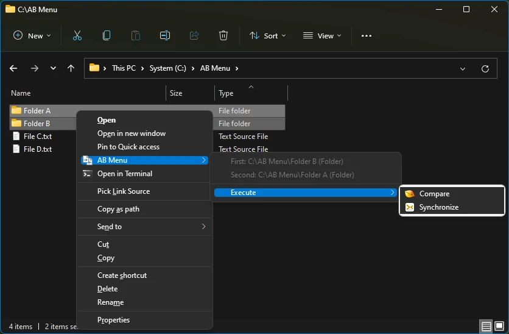

# AB Menu

A Windows context menu shell extension that proxies user configured commands accepting exactly two launch arguments (thus "AB" in the name) to any application.

Among the examples of such applications are comparison tools, file copy tools and text editors for side-by-side editing.

If the application does not come with its own shell extension, instead of having to manually type in terminal or create shortcut of it, user of this shell extension can create template of launch command with the two argument placeholders, select the item(s) in Windows Explorer and launch.

There are multiple ways to select items:

* When exactly two items (both files or both folders but not mixed) are selected, the shell extension will display the value of each argument placeholder and launch app.
* When only one item is selected for the first time, the shell extension remembers its path.
* When a different object is selected afterwards, the shell extension either launch app with the two arguments, or replaces the previously remembered first item, depending on user choice.

Again, the two items must be both files or both folders but not mixed.

## Install

* Unpack the archive.
* Run install.bat to register the shell extension.
* config.reg has some examples of user configurable commands. You can edit it and import into registry. The first selected item replaces the `%FIRST%` placeholder, while the second one replaces `%SECOND%`. `\` in the path needs to be escaped as `\\`.

## Uninstall

* Run uninstall.bat to de-register the shell extension.
* Open Registry Editor and remove `HKEY_CURRENT_USER\Software\AB Menu`.

## Build

A build script `build.ps1` is included to automate the process. It obtains dependencies and starts compilation. Before running `build.ps1`, make sure you have the latest Visual Studio installed. The script will automatically assume the Visual Studio developer environment and check out dependencies. To run the script, pass the target configuration and platform as arguments, e.g. `build.ps1 Debug x64` or `build.ps1 Release x86`.

## Screenshots

When two items are selected:

When the first item is selected:

After the first item is confirmed, when the second item is selected:

