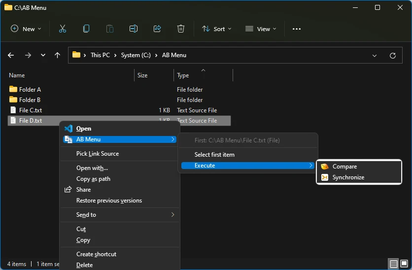

# Compare Menu

A Windows context menu shell extension that proxies general comparison commands to any diff application.

While many popular comparison applications such as Beyond Compare come with their own such shell extensions help improve user experience, there are good ones that still do not have. Rather than requesting each developer team to come up with their own solution, why not build a general one that can work everywhere as long as their take standard input arguments?

The concept of such context menu is simple:

* When exactly two files or two directories are selected, a "Compare Two" command becomes available, sending the two paths to the configured diff application.
* If only one object is selected for the first time, the menu remembers its path.
* If another object is selected afterwards, the menu either sends both paths to the diff application and reset, or replaces the previously remembered path, depending on user choice.

Note that a file can't be compared to a directory. So if the types mismatch, "Compare Two" won't be available, and the only option for single select mode is replacement.

## Install

* Unpack the archive.
* Run install.bat to register the shell extension.
* Open config.reg and edit the application path. `\` in the path needs to be escaped as `\\`.
* The command line part should include both the full path to the comparer executable, and its arguments with `%LEFT%` and `%RIGHT%` placeholders.
    * In the config.reg, we provided an example command line for [010 Editor's `-compare` parameter](https://www.sweetscape.com/010editor/manual/CommandLine.htm#-compare).

## Build

A build script `build.ps1` is included to automate the process. It obtains dependencies and starts compilation. Before running `build.ps1`, make sure you have the latest Visual Studio installed. The script will automatically assume the Visual Studio developer environment and check out dependencies. To run the script, pass the target configuration and platform as arguments, e.g. `build.ps1 Debug x64` or `build.ps1 Release x86`.

## Screenshots

Compare Two

Select First

Select Second

